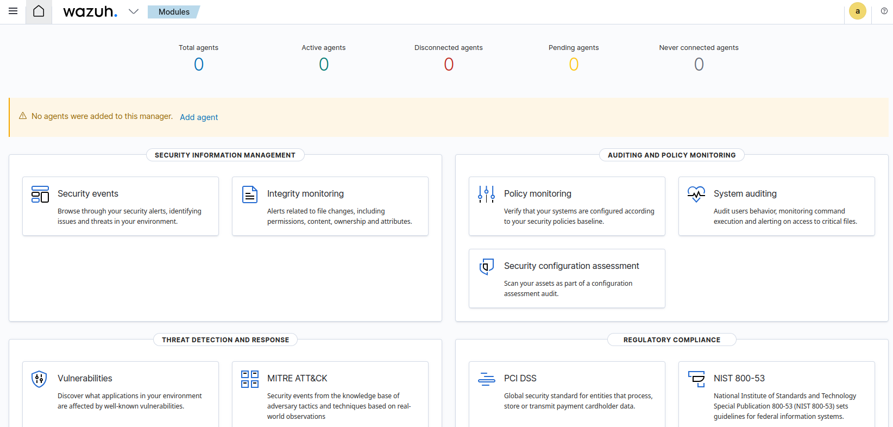

# Phase 02 – Wazuh Installation and Initial Setup

## Objective

The objective of this phase is to deploy and validate a SIEM platform in a controlled lab environment.

---

## Installation

The Wazuh SIEM platform was installed on an Ubuntu Server using the official installation script.

The installation included:

* Wazuh Manager
* Wazuh Indexer (OpenSearch)
* Wazuh Dashboard

The following command was used:

```
sudo ./wazuh-install.sh -a -i
```

---

## Initial Access

After installation, the Wazuh dashboard was successfully accessed via web browser:

```
https://192.168.142.134 (Wazuh Server)
```



---

## Verification

All core services were verified:

* wazuh-manager
* wazuh-indexer
* wazuh-dashboard

All services were running correctly.
At this stage, no agents are connected yet. Agent deployment will be performed in the next phase to enable log collection.

---

## Outcome

Wazuh SIEM is successfully installed and fully operational. The system is now ready for agent integration, log collection, and security monitoring.
