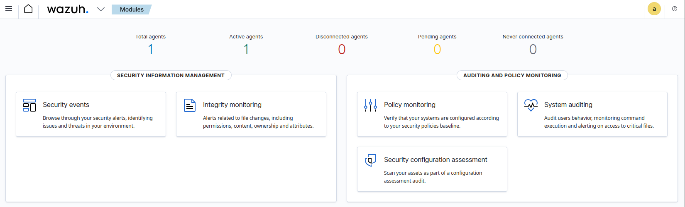

# Phase 03 – Agent Setup and Log Collection

## Objective

The objective of this phase is to connect a monitored endpoint to the SIEM platform in order to enable log collection and security monitoring.

---

## Agent Installation

The Wazuh agent was installed on the Ubuntu Server (victim machine).

Due to a version mismatch between the agent and the Wazuh manager, a compatible agent version was installed to ensure proper communication.

---

## Configuration

The agent was configured to communicate with the Wazuh server by modifying the configuration file:

```id="4z6vqp"
/var/ossec/etc/ossec.conf
```

The manager IP address was correctly set.

---

## Agent Registration

The agent was registered to the Wazuh manager using the following command:

```id="0n79zq"
sudo /var/ossec/bin/agent-auth -m <192.168.142.134>
```

After registration, the agent was restarted to apply the configuration.

---

## Verification

The agent status was verified:

* Service status: active (running)
* Agent visible in Wazuh dashboard
* Agent status: active



---

## Outcome

The endpoint is successfully connected to the SIEM platform.
Log collection and monitoring are now active.

