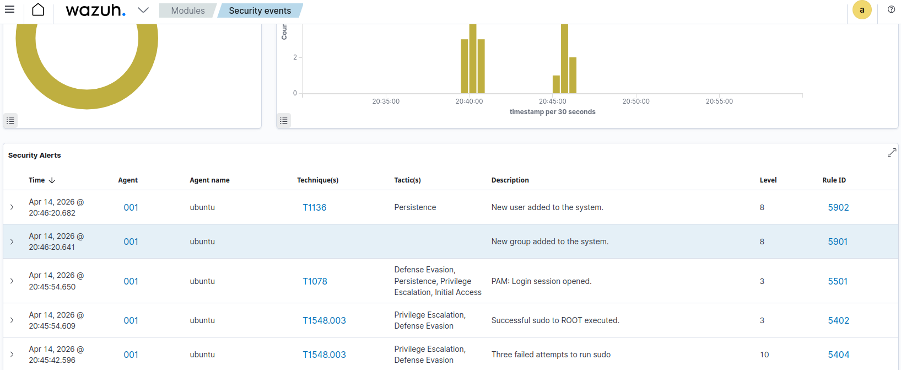
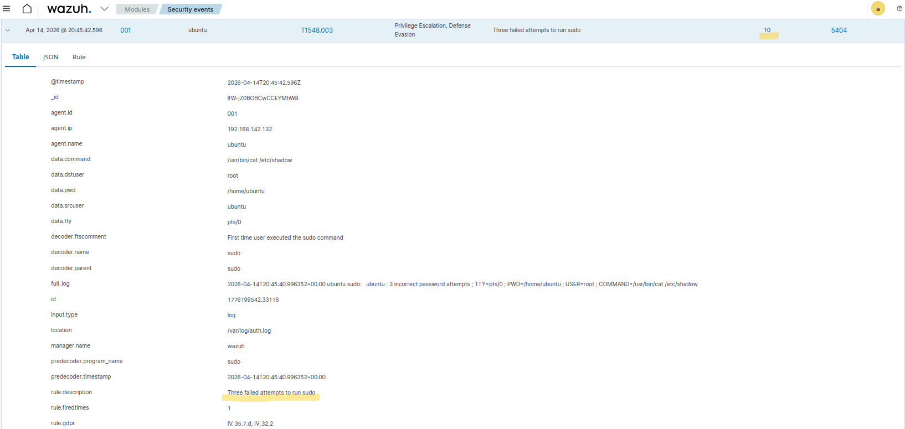
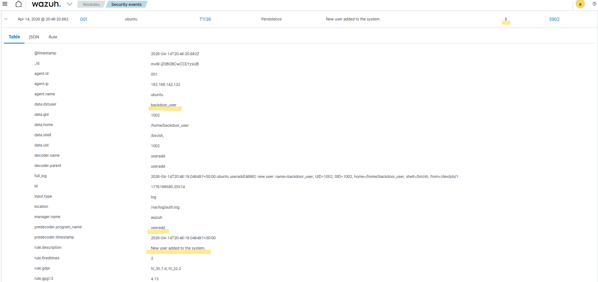

# Phase 04 – Security Incident Detection With SIEM

## Objective

The objective of this phase is to simulate a realistic security incident on a monitored endpoint and analyze how the SIEM detects and logs these activities.

---

## Incident Simulation

A sequence of suspicious actions was performed on the Ubuntu server to simulate a compromised account scenario.

The following activities were executed:

* Multiple failed attempts to run privileged commands using `sudo`
* Successful privilege escalation to root
* Creation of a new user account (`backdoor_user`)

These actions simulate an attacker attempting to gain elevated privileges and establish persistence on the system.

---

## Detection in SIEM

All activities were successfully detected by the SIEM platform.

The system generated multiple alerts, including:

* High-severity alerts for failed sudo attempts
* Alerts for successful privilege escalation
* Alerts for new user creation (persistence technique)

The SIEM detects these activities by analyzing system logs and applying predefined detection rules for suspicious privilege and authentication behavior.

---

## Evidence

### Privilege Escalation Events

---

### Failed Sudo Attempts

---

### User Creation Event

---

## Analysis

The sequence of events demonstrates an attack pattern:

1. Multiple failed attempts to execute privileged commands
2. Successful privilege escalation to root
3. Creation of a new user for persistence

This behavior is consistent with a compromised account attempting to gain full control of the system.

---

## Outcome

The correlation of multiple related alerts highlights the importance of SIEM platforms in identifying complex attack patterns rather than isolated events.
